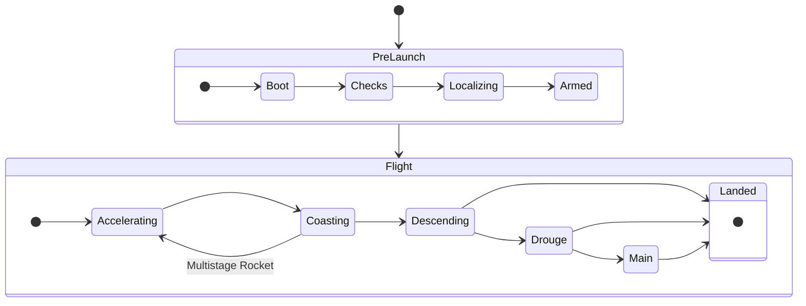

# Pioneer Rocketry Flight Computer V3

## Hardware

### Sensors/IC's
- Main MCU: STM32H745
- High G Accel: H3LIS100
- Low G Accel: AIS3624
- Gyro: I3G4250
- Magnetometer: MMC5603
- Barometer: MS560702BA03-50
- GPS: SAM-M8Q
- Thermocouple: MCP96L00T
- ADC: ADS1232

### Other Hardware Features
- 5 Pyro Channels
- 2 Switch 5v Rails
- 2 Switch Battery Rails
- MicroSD Card
- I2C, SPI Breakout
- 6 Servos
- Lora SX1262 Radio as Breakout Boards

## Software
- 3 Dof Kalman Filter for Position Estimation
- Live Telemetery
- *Active Control* (Long term project to keep rocket pointing up)
- Staging Logic/Inflight Events
- Software will be written in c++ using [STM32CubeIDE](https://www.st.com/en/development-tools/stm32cubeide.html)

### Software Flow States
- Boot and Inital System Check
- Kalman Filter Localization
- Preflight checks
- Flight Loop
    - Sensor Fusion
    - *PID Control* (active control)
    - Telemetry
    - Inflight Events
- Landing

### State Machine/Flow
The software will be a (mostly) linear state machine.
With states that include:
- Booting
- System Checks
- Localizing
- Armed
- Accelerating
- Coasting Up
- Apogee
- Descending
- Descending under Drouge Chute
- Descending under Main Chute
- Landed

The state machine can fo from Coasting up to Accelerating if its a multistage rocket. It can also skip states incase of any failures.

Also note that standard orientation solving doesn't work while the rocket is accelerating, where we will have to use intergration of angular velocity.

### Core Processes
| CM7 | CM4|
|--|--|
| Data collection | State Machine |
| Kalman Filter | Radio |
|  | Control/Events |

### Standards/Style
- Classes should use `camelCase` capitalization
- Variables should use `camelCase` capitalization
- Variables should be short and descriptive
    - example: posX
- Constants should use `CAPS_LOCK_SNAKE_CASE` capitalization
- Functions should use `camelCase` capitalization
- Functions should have docstrings saying what each variable is, and what the output is.
- All git commits should have a message that talks about what was changed

### Testing

#### Hardware-in-the-loop Testing (HILT)
HILT uses "fake" sensor readings to simulate a flight.
This is done by plugging it into a computer, and sending it data via USB/Serial, and having it pretend like its flying

#### Flight Tests
Flights are going to start out basic by just trying to quantify where the rocket is, and how fast. As well as testing state transitions. \
After every successful flight we can add more features like testing parachute deployment, then 2nd stage deployment ignition, then control. \
We also need to test it in high Speed and high G flights.

### AHRS and Position Estimation
Attitude and Heading Reference System (AHRS) On the ground and after motor burnout we can use either Mahony filter or Madgwick filters. While the motor is buring we can use either of the filters without the accelerometer correction. Can also just intergrate angular velocity to get the Attitude.\
We should use a Quaterinion to represent the Attitude.

Position Estimation uses an Async Kalman Filter. \
Then taking accelerometer reading from both IMU, and rotates them based on the Attitude from the AHRS system.
The Kalman Filter finds the best estimation of the position using the accelerometer readings, and GPS readings.